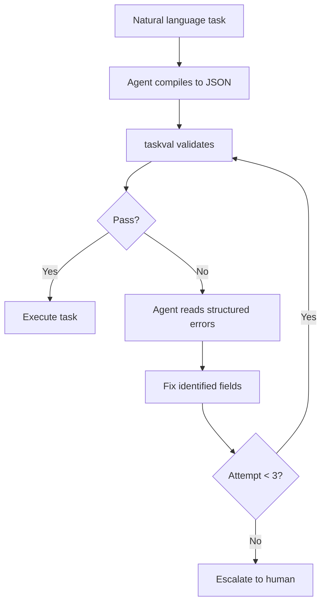

Tell an AI coding agent to "implement search" and it will. It'll pick a library you didn't want, create files in directories you didn't expect, and deliver something that technically works but spiritually misses the point. The agent wasn't wrong -- you were vague, and vagueness is an invitation for assumptions. The agent made twelve of them. You agreed with seven.

That five-assumption gap is where rework lives.

## The shape of the problem

Every natural language task description has holes. "Add a CLI flag for export format" leaves unanswered: which formats? What's the default? Where does output go -- stdout or file? What happens when someone passes `--format xml` and you don't support XML? Does the output include colour codes or is it pipe-safe? These aren't edge cases. These are the actual specification, and you skipped all of it.

The conventional fix is "write better prompts." This is the "just be more careful" school of engineering, and it works about as well as telling someone to "just write fewer bugs." The problem isn't carelessness. The problem is that natural language doesn't have a compiler. There's no syntax error for an ambiguous instruction -- the agent just picks an interpretation and keeps going.

So Opus and I built one. Not for me though ;) For Opus.

## Two tiers of refusal

Task Templating defines a structured format where every task must declare its `TASK_ID`, `TASK_NAME`, `GOAL`, `INPUTS`, `OUTPUTS`, and `ACCEPTANCE` criteria. No optional hand-waving. The `taskval` CLI then runs two tiers of validation, because being thorough is the entire point.

**Tier 1** is structural. JSON Schema checks that required fields exist, types are correct, `task_id` matches kebab-case, `priority` is one of `critical | high | medium | low`, and your inputs array isn't empty. Deterministic, zero-LLM, pass-or-fail. This catches the "you forgot to fill in the form" class of errors.

**Tier 2** is where it gets interesting. Semantic validation runs only if Tier 1 passes, and it checks things JSON Schema can't express:

| Rule | What it catches | Severity |
|------|----------------|----------|
| V2 | Duplicate `task_id` across tasks | ERROR |
| V4 | Dependency references that point at nothing | ERROR |
| V5 | Circular dependencies (via Kahn's algorithm) | ERROR |
| V6 | Goals containing "try", "explore", "investigate" | ERROR |
| V7 | Acceptance criteria containing "works correctly" | WARNING |
| V9 | Missing contextual fields without justification | WARNING |
| V10 | Implementation tasks missing `files_scope` | WARNING |

Rule V6 is the one that earns its keep. If your goal starts with "try to add search functionality," you don't have a goal -- you have a hope. The validator rejects it and tells you to rewrite it as a testable outcome. "The `Search()` function returns ranked results from Weaviate hybrid search" is a goal. "Explore search options" is a meeting agenda item.

V7 does the same for acceptance criteria. "It works correctly" is not a test case. "Given input `'machine learning'` with `--limit 5`, the command returns at most 5 results, each with a Harvard citation" is a test case. The difference matters when an agent is deciding whether it's done.

## The feedback loop

The pipeline is designed for agents to self-correct:



Every error comes back with a rule ID, JSON path, problem description, and an actionable fix suggestion. The agent doesn't need to guess what went wrong -- the validator tells it exactly which field failed, why, and what a correct version looks like.

```bash
$ taskval --mode=task examples/invalid_task.json
VALIDATION FAILED

  1. [ERROR] Rule V6
     Path:    tasks[0].goal
     Problem: Goal contains the forbidden word/phrase 'try'.
     Fix:     Rewrite the goal as a concrete, testable outcome.
              Instead of 'try ...', describe what the system
              does when the task is complete.
```

The agent reads this, rewrites the goal, and resubmits. No human in the loop. The conversation between the validator and the agent is the quality gate, and it runs in about 200 milliseconds.

## DAGs, not wish lists

Tasks have dependencies, and dependencies must form a Directed Acyclic Graph. The validator enforces this with Kahn's algorithm -- a topological sort that detects cycles by counting in-degrees. If task A depends on task B which depends on task A, the validator tells you which tasks are involved and suggests breaking the cycle by decomposing one of them.

This matters because task graphs get created by agents too. You say "build the search pipeline," the `/taskify` skill decomposes it into 10-15 tasks, and each task declares its dependencies. If the decomposition accidentally introduces a circular dependency -- and LLMs do this more often than you'd expect -- the validator catches it before anyone tries to execute an impossible ordering.

```json
{
  "task_id": "weaviate-hybrid-search",
  "depends_on": ["weaviate-client-setup", "embedding-pipeline"],
  "goal": "A Search() function queries Weaviate using hybrid search and returns ranked chunk results with scores.",
  "acceptance": [
    "Results are sorted by descending score",
    "Context cancellation mid-query returns context.Canceled error",
    "Empty collection returns empty list and nil error"
  ]
}
```

No "it should work." No "explore the options." Every field is a contract, and the contract is enforced before execution starts.

## From validated graph to tracked issues

Validation is necessary but not sufficient. Validated tasks need to become tracked work. The `--create-beads` flag bridges the gap -- it takes a validated task graph and creates issues in the Beads (`bd`) issue tracker, preserving the dependency structure, mapping priorities and estimates, and attaching the full task specification as structured metadata.

```bash
$ taskval --create-beads examples/valid_task_graph.json
VALIDATION PASSED
  Tasks validated: 3

BEADS CREATION
  Epic created: bd-a1b2 "Task Graph: M1 - Core Infrastructure"
  Task created: bd-c3d4 "Implement discount calculation..." (calculate-discounted-total)
  Task created: bd-e5f6 "Add --format flag..." (cli-export-format-flag)
  Task created: bd-g7h8 "Implement hybrid BM25..." (weaviate-hybrid-search)
```

The pipeline runs in topological order -- dependencies are created before the tasks that depend on them, so the issue tracker's dependency graph mirrors the task graph's DAG exactly. Priority mapping converts the spec's `critical | high | medium | low` to numeric values. Estimate mapping converts `trivial | small | medium | large` to minutes. Everything the agent needs to pick up the work and start executing is already in the issue.

A `--dry-run` flag previews the `bd` commands without executing them, for the appropriately paranoid.

## The `/taskify` skill

The whole pipeline collapses into a single Claude Code slash command:

```bash
/taskify docs/oauth-spec.md
```

The skill reads the spec, decomposes it into a structured task graph, validates it against the schema, self-corrects if validation fails (up to three attempts), and records the result as tracked Beads issues. Natural language in, validated and tracked work items out.

You can also pass inline descriptions:

```bash
/taskify "Add OAuth2 support with Google and GitHub providers"
```

The agent identifies distinct units of work (each targeting 30 minutes to 4 hours of effort), maps dependencies, assigns file scopes, writes testable acceptance criteria, and validates the lot. If a goal contains "explore" or an acceptance criterion says "works correctly," the validator rejects it, the agent rewrites it, and the user never sees the vague version.

## The actual stack

The whole thing is Go. One external dependency: `kaptinlin/jsonschema` for JSON Schema Draft 2020-12 validation. The Go standard library provides everything else -- JSON parsing, regex for goal quality checks, embedded filesystem for bundling schemas. The `taskval` binary compiles to a single executable. No Docker. No database. No runtime dependencies.

The validator, the beads integration, and the CLI total about 1,500 lines of Go. Kahn's algorithm for cycle detection is 50 lines. The vague-phrase detector for acceptance criteria is a list of eight regex patterns. The entire semantic validation tier is a single file. Keeping the validation pipeline lightweight is the kind of constraint that prevents it from becoming the problem it's trying to solve.

## The meta-point

Every AI agent quality problem is, at its root, a specification problem. The agent didn't hallucinate -- you under-specified. The agent didn't go rogue -- it filled the gaps you left with reasonable-sounding assumptions that happened to be wrong. The fix isn't a better model. The fix is a better contract.

Task Templating is that contract, with a compiler that rejects the vague parts before they become code.
